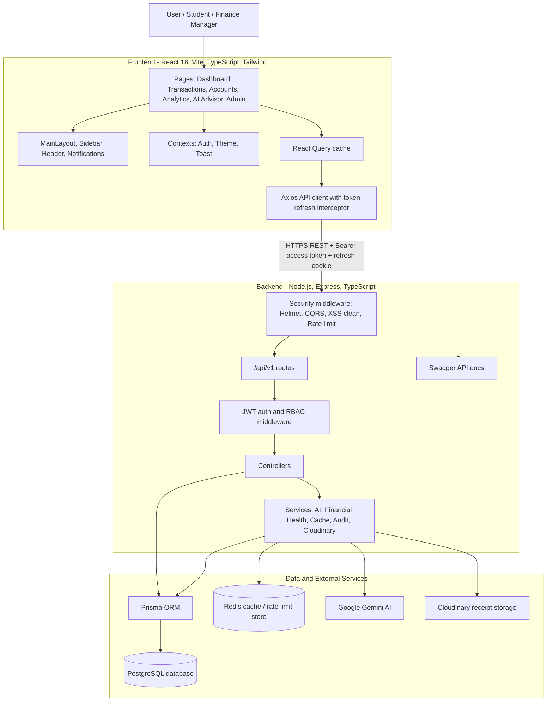
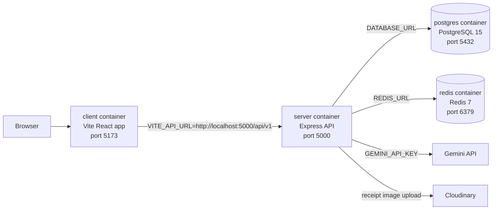
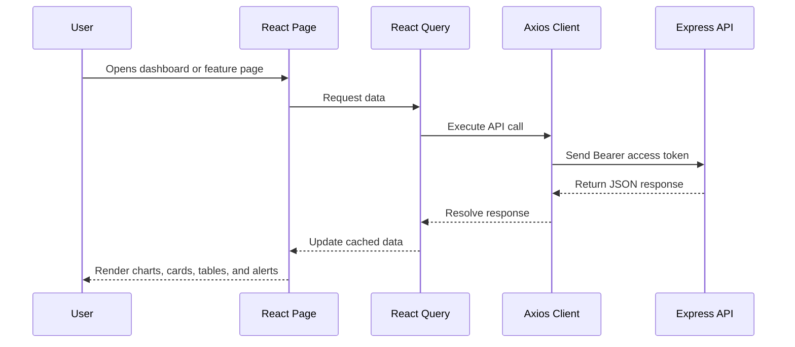
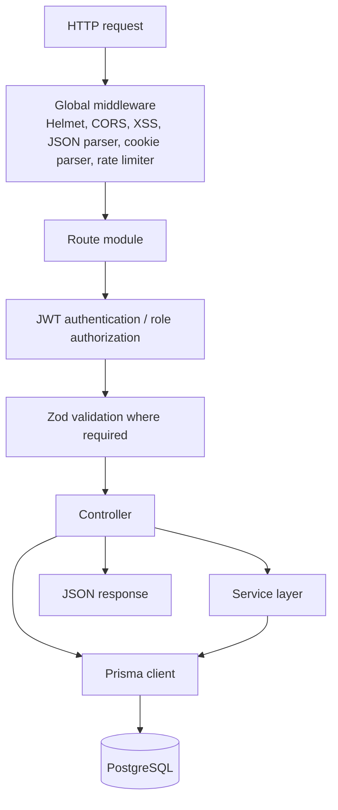
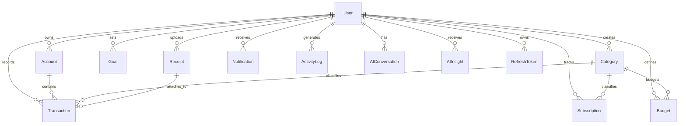
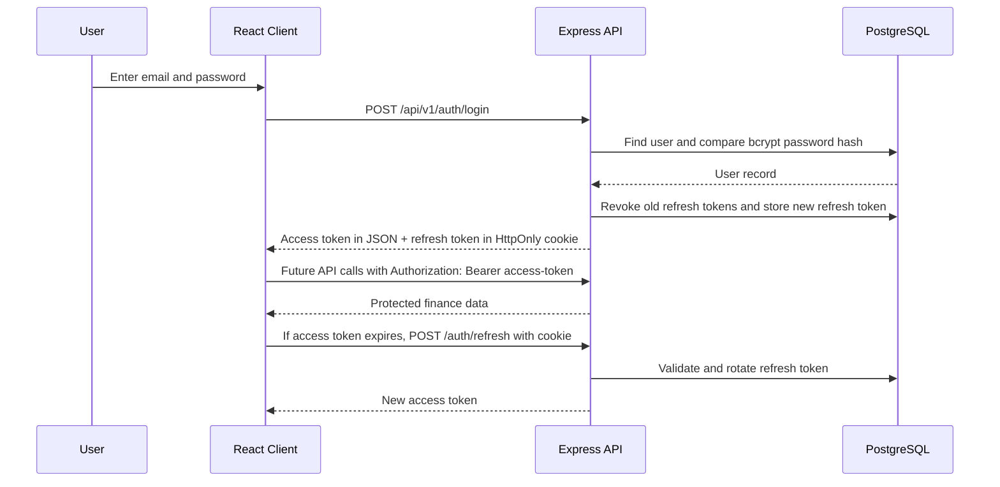
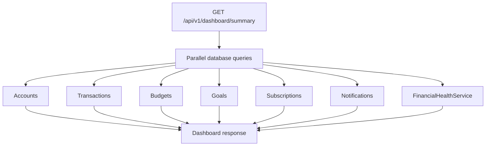
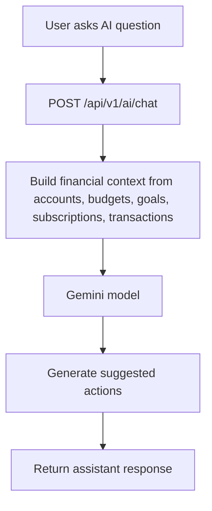

# FinSight AI - Architecture Documentation

FinSight AI is a full-stack personal finance and wealth management application. It uses a React + TypeScript frontend, an Express + TypeScript REST API, Prisma ORM, PostgreSQL, Redis, Gemini AI, and Cloudinary-backed receipt handling. The system is designed as a decoupled client-server application where the browser communicates with the backend through secured REST endpoints.

## 1. High-Level Architecture Diagram



## 2. Deployment Architecture



The local Docker setup is defined in `docker-compose.yml`. It starts four main services: PostgreSQL, Redis, the Express backend, and the React frontend. The Prisma schema targets PostgreSQL through the `DATABASE_URL` environment variable.

## 3. Source Code Organization

```text
FinSight/
├── client/                       React frontend
│   ├── src/
│   │   ├── pages/                Feature screens and route pages
│   │   ├── components/           Reusable UI, layout, and AI components
│   │   ├── context/              Auth, theme, and toast providers
│   │   ├── lib/                  Axios API client and shared utilities
│   │   └── types/                Shared frontend TypeScript models
│   └── tests/                    Playwright end-to-end tests
├── server/                       Express backend
│   ├── prisma/                   Prisma schema, migrations, seed script
│   ├── src/
│   │   ├── config/               Environment, DB, Redis, Swagger setup
│   │   ├── controllers/          Request handlers for each module
│   │   ├── middleware/           Auth, validation, rate limiting, errors
│   │   ├── routes/               REST route definitions
│   │   ├── services/             Business logic and integrations
│   │   └── utils/                JWT and logging helpers
│   └── tests/                    Jest + Supertest backend tests
├── README.md                     Project introduction and quick start
├── API_REFERENCE.md              REST API summary
├── PRODUCT_OVERVIEW.md           Feature overview
├── ARCHITECTURE.md               This architecture document
└── docker-compose.yml            Local container orchestration
```

## 4. Frontend Architecture

The frontend is a single-page application built with React 18, Vite, TypeScript, Tailwind CSS, React Router, React Query, Axios, Recharts, Framer Motion, and Lucide icons.

### Main Responsibilities

- Render protected finance pages such as Dashboard, Transactions, Budgets and Goals, Subscriptions, Analytics, Accounts, AI Advisor, Notifications, Settings, and Admin Panel.
- Manage login state through `AuthContext`.
- Use `ThemeContext` and `ToastContext` for application-wide UI behavior.
- Cache server data with React Query.
- Use lazy-loaded pages in `App.tsx` to split route bundles and reduce first-load cost.
- Call backend APIs through `client/src/lib/api.ts`.

### Frontend Request Flow



If an API call returns `401`, the Axios response interceptor calls `/auth/refresh` using the refresh token cookie. When refresh succeeds, a new access token is stored and the original request is retried automatically.

## 5. Backend Architecture

The backend is an Express API written in TypeScript. The server entry point is `server/src/server.ts`. It configures security middleware, JSON parsing, cookie parsing, rate limiting, Swagger documentation, route mounting, a health check, and a global error handler.

### Backend Layers



### API Modules

| Module | Main Routes | Purpose |
| --- | --- | --- |
| Authentication | `/auth/register`, `/auth/login`, `/auth/refresh`, `/auth/logout`, `/auth/me` | User registration, login, session refresh, logout, profile lookup |
| Users | `/users/profile` | Update profile information |
| Accounts | `/accounts` | Manage bank, cash, credit card, loan, and investment accounts |
| Categories | `/categories` | List system and user categories |
| Transactions | `/transactions`, `/transactions/scan-receipt` | Track income, expenses, transfers, and receipt scanning |
| Subscriptions | `/subscriptions`, `/subscriptions/:id/record-payment` | Manage recurring bills and record subscription payments |
| Budgets | `/budgets` | Create and track category budgets |
| Goals | `/goals` | Track savings and financial goals |
| Dashboard | `/dashboard`, `/dashboard/summary` | Return combined financial KPIs and widgets |
| Analytics | `/analytics` | Return spending and financial analytics |
| AI | `/ai/summary`, `/ai/chat`, `/ai/insights` | Generate AI reports, chat responses, and insights |
| Notifications | `/notifications`, `/notifications/:id/read` | Display and mark notifications |
| Admin | `/admin/users`, `/admin/metrics`, `/admin/audit-logs` | Admin-only user, system, and audit views |

## 6. Database Architecture

Prisma models define the relational data structure. The main user-owned data model is:



### Important Entities

- `User`: Stores identity, role, currency, theme, and profile details.
- `RefreshToken`: Stores refresh tokens and revocation status for session rotation.
- `Account`: Stores financial account balances and account types.
- `Category`: Stores income and expense categories.
- `Transaction`: Stores income, expense, and transfer records.
- `Subscription`: Stores recurring bill information and next billing dates.
- `Budget`: Stores category budget limits.
- `Goal`: Stores target amounts and progress for savings goals.
- `Receipt`: Stores OCR output and Cloudinary metadata.
- `Notification`: Stores alerts such as budget alerts and bills due.
- `ActivityLog`: Stores audit trail events.
- `AIConversation` and `AIInsight`: Store AI assistant conversations and generated insights.

## 7. Authentication and Security Flow



Security controls implemented in the codebase include:

- Password hashing with `bcryptjs`.
- Access tokens and refresh tokens with JWT.
- Refresh token rotation and server-side revocation.
- `HttpOnly` refresh-token cookies using `SameSite=Lax`.
- Role-based access control for admin routes.
- Helmet security headers.
- CORS with a frontend origin allow-list.
- XSS sanitization.
- Rate limiting for API and authentication endpoints.
- Zod validation for authentication payloads.
- Audit logging for important auth events.

## 8. Financial Dashboard Working

The dashboard combines many data sources into one response. `DashboardController.getSummary` queries accounts, transactions, categories, subscriptions, budgets, goals, notifications, and the financial health service.



The dashboard response includes net worth, monthly income, monthly expenses, cash flow, savings rate, account count, top spending categories, largest transactions, subscription spend, upcoming bills, budget burn rate, savings goal progress, spending heatmap, net worth trend, recent activity, notifications, and a financial health score.

## 9. Financial Health Score Engine

`FinancialHealthService.calculateHealthScore` produces a composite score from five weighted factors:

| Factor | Weight | Calculation Meaning |
| --- | ---: | --- |
| Savings rate | 25% | Measures monthly income retained after expenses |
| Budget adherence | 25% | Measures whether budget categories are within limits |
| Debt ratio | 20% | Compares liabilities against total capital |
| Emergency fund | 15% | Estimates how many months expenses can be covered by liquid cash |
| Investment ratio | 15% | Measures investment allocation relative to net worth |

The service also assigns grades from `A+` to `F` and returns practical recommendations based on weak areas.

## 10. AI Advisor and Receipt OCR Working



The AI service builds a structured financial context block containing the user's account balances, cash flow, budgets, goals, subscriptions, and recent transactions. Gemini uses that context to generate finance-specific answers. The service also generates suggested actions such as transferring savings, auditing subscriptions, or reviewing over-budget categories.

Receipt scanning is exposed through `POST /api/v1/transactions/scan-receipt`. The route accepts an uploaded file through Multer, sends the receipt image to Gemini Vision when configured, extracts merchant, amount, date, and category, and stores receipt-related metadata.

## 11. Caching and Performance

Redis is used for caching and rate-limiting support. The architecture supports an in-memory fallback when Redis is unavailable. Frontend performance is supported by React Query caching and lazy-loaded route components. Backend dashboard performance is improved through parallel Prisma queries.

## 12. Error Handling and Validation

- Global Express error handling is registered after all routes.
- Authentication routes use Zod validation for register and login payloads.
- Protected routes use `authenticateJWT`.
- Admin routes use both `authenticateJWT` and `requireRole(['ADMIN'])`.
- Axios interceptors handle expired access tokens and redirect to login when refresh fails.

## 13. Testing Strategy

- Backend tests use Jest and Supertest.
- Frontend end-to-end tests use Playwright.
- TypeScript build checks are available in both client and server packages.
- Swagger documentation is available at `http://localhost:5000/api-docs` when the backend is running.

## 14. Summary

FinSight AI follows a clean full-stack architecture with separate presentation, API, service, and data layers. It demonstrates modern web development practices including typed frontend development, REST APIs, ORM-based database access, secure token-based authentication, role-based authorization, AI integration, receipt OCR, financial analytics, containerized deployment, and project documentation suitable for academic demonstration and future enhancement.
